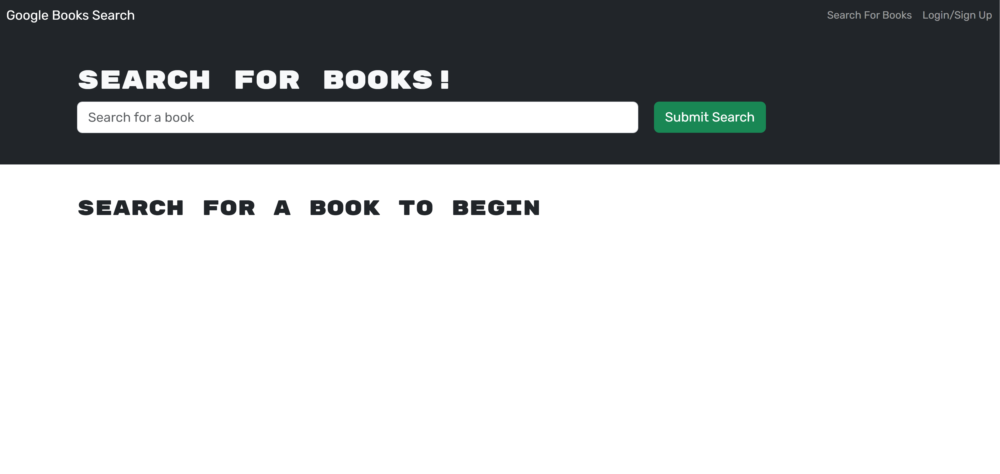
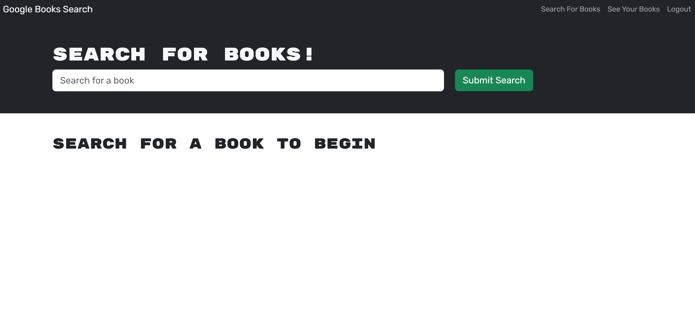

# Book_Search_Engine

## Description:
This porject is a book search engine, the code was generated by myself with the assistance of the GWU coding Boot camp tutoring program. Using this will allow a user to search any book by title. Additionally by logging in the user will have the ability to save the book to a list of "my saved books".

## Installation:
This application requires no additional softeware or programs to be installed. Access to a stable internet connection and the link to the website are all that are required to use this application.

## Usage: 
### The user will open the site and be greeted with this homescreen

### The user will then type in the name of any city and be shown the current weather and conditions,

### The user upon scrolling down will see the same information as listed above but for the next five day forecast,

### The user will have the ability to type any any city name and the previous city data will be cleared from the screen and new data will be uploaded,

MIT License

#### A deployed link for this application is:
https://gasiorowski-book-searcher-9fe69fedaf2f.herokuapp.com/

